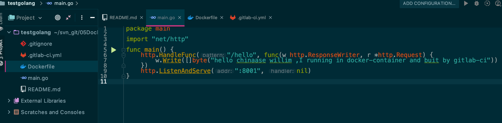
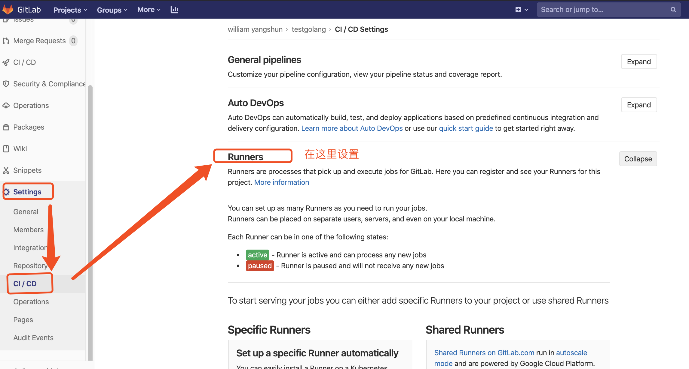
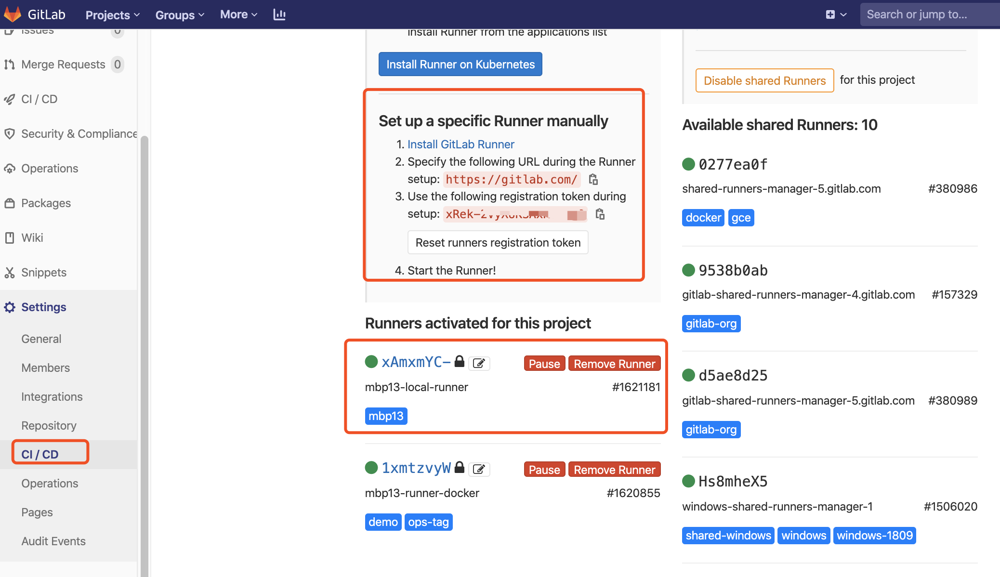
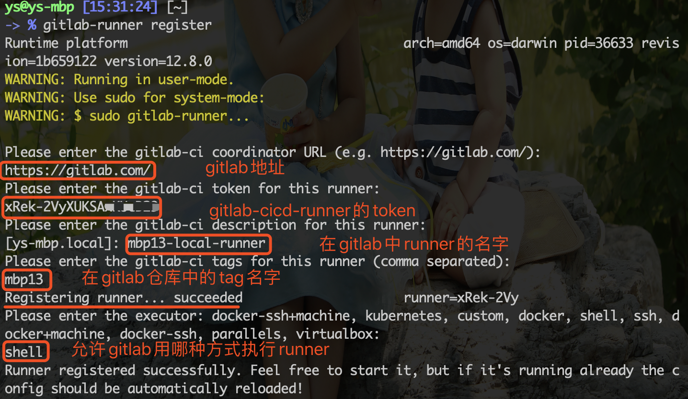
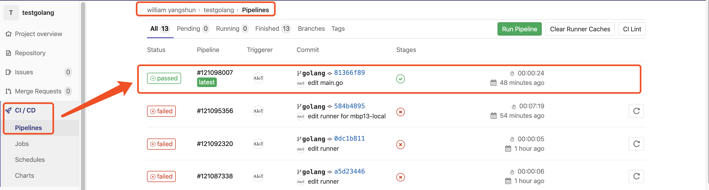
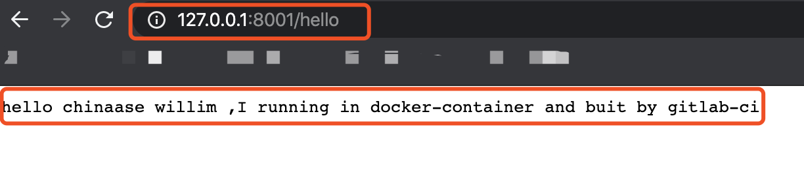

### gitlab-cicd
`快速掌握并使用gitlab-ci工具快速代码编译、集成和发布`

[课程学习源码和文档](https://github.com/yangshun2005/gitlab-cicd)

[学习视频地址](https://www.bilibili.com/video/av92022124/)

一、准备工作

1.1. gitlab环境：代码仓库和编译器

1.2. 目标机：装有`docker`和`gitlab-runner`环境的服务器（Linux或类unix机器）

1.3. 项目代码：testgolang为例（gitlab官网仓库）

1.4. Dockerfile：对程序编译后打镜像

1.5. .gitlab-ci.yml ：CI/CD的gitlab机器运行逻辑的操作文档

二、环境配置

2.1. 准备一台，为项目注册执行部署任务的Runner服务器

2.2. 将runner机器与gitlab的cicd`注册`,完成链接并打通

三、提交更新并自动部署到服务器，测试地址：http://127.0.0.1:8001

3.1. 提交代码到git golang分支

3.2. 等待Job任务完成

3.3 测试结果


### 一、准备工作

1. gitlab环境（为了方便，使用官方的托管仓库）

2. 装有`docker`和`gitlab-runner`环境的云服务器（这里用到CentOS 7 64位）
> gitlab-runner安装方法:
>> https://docs.gitlab.com/runner/install/osx.html

3. 项目代码，这里我使用Golang作为开发语言，其它开发语言也一样的操作流程



4. `Dockerfile`文件
```
# 镜像文件
FROM golang:latest
# 维修者
MAINTAINER William "2095686947@qq.com"

# 镜像中项目路径
WORKDIR $GOPATH/src/chinaase.com/testgolang
# 拷贝当前目录代码到镜像
COPY . $GOPATH/src/chinaase.com/testgolang
# 制作镜像
RUN go build .

# 暴露端口
EXPOSE 8001

# 程序入口
ENTRYPOINT ["./testgolang"]
```

5. `.gitlab-ci.yml`文件
```
stages:
  - deploy

docker-deploy:
  stage: deploy
# 执行Job内容
  script:
# 通过Dockerfile生成cicd-demo镜像
    - docker build -t testgolang .
# 删除已经在运行的容器
    - if [ $(docker ps -aq --filter name= testgolang) ]; then docker rm -f testgolang;fi
# 通过镜像启动容器，并把本机8000端口映射到容器8000端口
    - docker run -d -p 8001:8001 --name testgolang testgolang
  tags:
# 执行Job的服务器
    - mbp13
  only:
# 只有在golang分支才会执行
    - golang
```

### 二、环境配置

1. 为项目注册执行部署任务的Runner服务器
因为我已经配置过了，所以下面面有runner，runner的标签是多runner执行任务时区分的标识，后面部署过程我会使用标签为 `mbp13`服务器来执行`job`，下面会截图配置过程。


2. 将runner机器与gitlab的cicd链接并注册打通
> 查看地址和gitlab-ci的token



> 在runner机器上设置
`实际就是runner要向gitlab服务发起register`
>> https://docs.gitlab.com/runner/register/index.html


 
> 补充：

```
sudo groupadd docker     #添加docker用户组
sudo gpasswd -a gitlab-runner docker     #将登陆用户加入到docker用户组中
newgrp docker     #更新用户组
su gitlab-runner #切换到runner用户组
docker ps    #测试docker命令是否可以使用sudo正常使用
```

### 三、提交更新并自动部署到服务器
runner注册成功后，通过git命令提交更新到golang分支，只要golang分支有修改，都会执行Job的任务。
> git push 代码到`golang分支`, gitlab-ci的功能自动扫描`.gitlai-ci.yml`文件，并启动

> 最终的执行结果gitlab的CI/CD菜单里的`jobs`里呈现


### 四、访问
最后，通过链接 `http://127.0.0.1:8001/hello` 可以看到服务器已经部署代码并且可以正常访问了


> 补充： docker 部署gitlab服务

```
docker pull beginor/gitlab-ce:11.3.0-ce.0

docker run --detach --publish 8443:443 --publish 8880:80 --publish 8822:22 --name my-gitlab --restart unless-stopped --volume /Users/ys/svn_git/05Docker_workspace/gitlab/etc:/etc/gitlab --volume /Users/ys/svn_git/05Docker_workspace/gitlab/log:/var/log/gitlab --volume /Users/ys/svn_git/05Docker_workspace/gitlab/data:/var/opt/gitlab --privileged=true -d beginor/gitlab-ce:11.3.0-ce.0
```

> 注意：

```
预备知识：
    docker命令使用
    git命令使用
    gitlab的使用
    .gitlab-ci.yml的编写
    使用一种开发语言，本处使用golang举例
```

